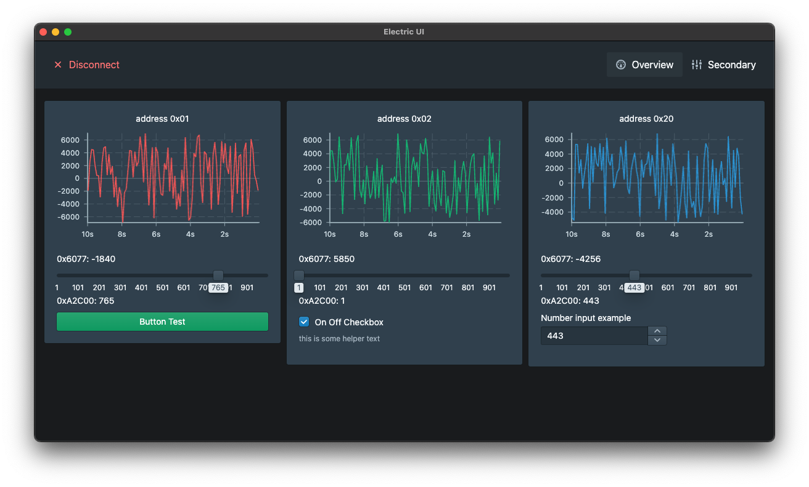

# smac-electricui-example

This example project showcases integrating the SMAC protocol with Electric UI.

The connection screen:


The main screen:



## Installation

1. Follow the [Electric UI installation instructions](https://electricui.com/install). VSCode is the recommended code editor.

2. This repo can be cloned or downloaded in .zip format from the GitHub interface.


3. Once the repo is downloaded, navigate to it with your operating system's terminal, run `arc install` to install dependencies. A successful installation will look like this:


4. The application can be run in development mode with `arc start`.
5. A stand-alone application can be built with `arc build`.


## The SMAC Protocol

The protocol is implemented in `./src/transport-manager/config/smac.ts`.

In short, the protocol consists of a node ID, a **R**ead or **W**rite indicator, an object ID, and a value if writing. A typical exchange may be:

```
> is outgoing from UI to device
< is receiving by UI from device

> 0x00 W 0xB2C00 5 // broadcast a write to object 0xB2C00 with a value of 5
> 0x20 R 0xB2C00   // read the value of object 0xB2C00 at address 0x20
< 0x20 W 0xB2C00 5 // the UI receives the value of 5 from object 0xB2C00 at address 0x20
```

A carriage return character deliminates messages.

#### In Electric UI

- The objectID / register / object index is mapped directly to the `messageID` in Electric UI.
- The address / node number is provided as `Message` metadata and as a tag within the persistence engine.
- By default messages are broadcast on write, and on read the latest message from any node is displayed.
- Specific addresses can be written to and read from by using the `AddressFilter` wrapper component.

Typical API usage looks like:

```tsx
export const Page = () => {
  const noiseDs = useMessageDataSource('0x6077')

  return (
    <AddressFilter address="0x01">
      
      {/* The 0x6077 and 0xA2C00 object IDs will be polled every 100ms from the node at 0x01 */}
      <IntervalRequester messageIDs={['0x6077', '0xA2C00']} interval={100} />
      
      {/* The value of object 0x6077 at address 0x01 will be displayed */}
      Value: <Printer accessor="0x6077" />
      
      {/* On click, send the value of 6 to the 0x6040 object ID */}
      <Button
        writer={state => {
          state['0x6040'] = 6
        }}
      >
        Button Test
      </Button>
      
      {/* A checkbox that reads and writes from object ID 0xA2C00 */}
      <Checkbox
        accessor={state => state['0xA2C00']}
        checked={1}
        unchecked={0}
        writer={(state, value) => {
          state['0xA2C00'] = value
        }}
      >
        On Off Checkbox
      </Checkbox>
      
      {/* A chart that displays object 0x6077 as a red line */}
      <ChartContainer>
        <LineChart dataSource={noiseDs} color={Colors.RED4} />
        <RealTimeDomain window={[1_000, 5_000, 10_000]} />
        <TimeAxis />
        <VerticalAxis />
      </ChartContainer>
      
    </AddressFilter>
  )
}

```

## Pages and Components

### Overview Page

The overview page demonstrates a simple UI, showing state from three separate addresses, with a variety of components.

It is editable here:

 `./src/application/pages/DevicePages/OverviewPage.tsx`

There are three cards displayed, each with a different `AddressFilter`. Inside each is an `IntervalRequester`, `ChartContainer`, two Printers, `PollOnce` component, a `Slider`, and an additional component.

The `AddressFilter` component creates a subtree of components that can only interact with a specific node's address. Specifically, it creates an `IntervalRequester` context, `OutgoingMessageMutator`, `EventConnector` and `DomainWrapper` that isolate all incoming and outgoing messages based on the `address` prop provided.

The `IntervalRequester` will poll specific object IDs at a provided rate in milliseconds.

The `ChartContainer` pulls data from the `useMessageDataSource` hook above, tagging the request with the address from the `AddressFilter` wrapper.

The `PollOnce` component acts as a 'handshake', polling a value once on mount.

### Adding additional pages

Additional pages can be added by creating the page file, adding the page reference to the index of `DevicePages`, and modifying the header component to add a button to navigate to the page.

Pages are placed in the `./src/application/pages/DevicePages/` folder, and export their page component.

```tsx
// ./src/application/pages/DevicePages/SecondaryPage.tsx
import React from 'react'
import { RouteComponentProps } from '@reach/router'
import { Card } from '@blueprintjs/core'

export const SecondaryPage = (props: RouteComponentProps) => {
  return (
    <div>
      <Card>Other content here</Card>
    </div>
  )
}
```

Pages are imported by the index and added to the route list.

```tsx
// ./src/application/pages/DevicePages/index.tsx
import { SecondaryPage } from './SecondaryPage'

// ...

<Router primary={false}>
  <OverviewPage path="/" />
  {/* Page is added with the key 'secondary' here */}
  <SecondaryPage path="secondary" />
</Router>
```

Additional buttons can be added to the header component to navigate to new pages.

```tsx
// ./src/application/components/Header

// ...

<Button
  minimal
  large
  icon={IconNames.SETTINGS}
  text="Secondary"
  onClick={() => {
    // Navigate to the 'url' at the current deviceID, to the key of the page
    navigate(`/devices/${props.deviceID}/secondary`)
  }}
  active={page === 'secondary'}
/>
```

### Connection Page

The connection page allows for manual selection of the serial port and baud rate. The SerialPortSelector component is located at `./src/application/components/SerialPortSelector`.

## Debugging

Raw packet logging can be enabled by editing the  `./src/transport-manager/config/smac.ts` file and uncommenting the `console.log` commands. After restarting the application, the logs will be displayed in the Transport Process developer tools console. (This can be enabled via the DevTools menu, via 'Toggle Developer Tools', if it doesn't open automatically.)

https://github.com/Mike-Dax/smac-electricui-example/blob/1f80f353dc6e2a602eed0effb89c005605f033c0/src/transport-manager/config/smac.ts#L26

https://github.com/Mike-Dax/smac-electricui-example/blob/1f80f353dc6e2a602eed0effb89c005605f033c0/src/transport-manager/config/smac.ts#L99
